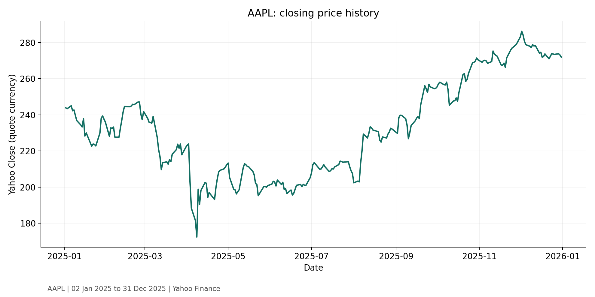
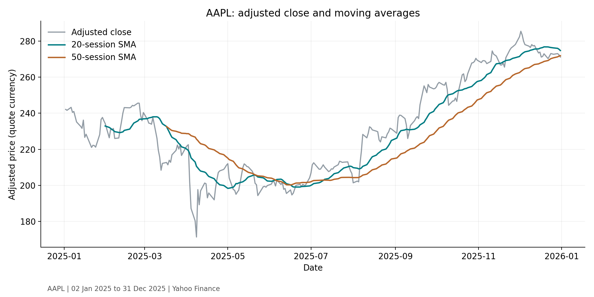
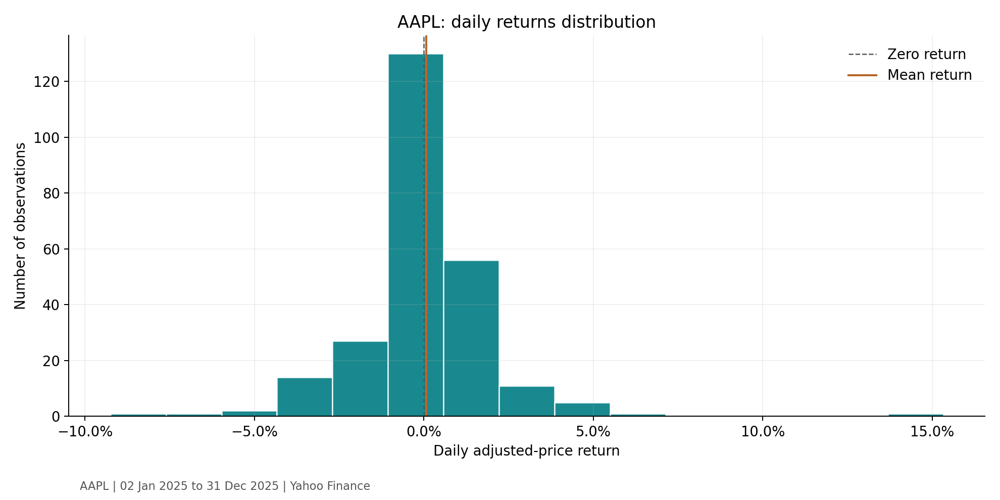

# Stock Price Data Visualisation

ArithMatrix AVIP 2026 | Data Science | Task 3

## Question and scope
How did **AAPL** prices, moving averages and daily returns behave during the selected period?
Requested dates: **2025-01-01 to 2025-12-31**, both inclusive.
Actual observations: **2025-01-02 to 2025-12-31** (250 rows).

## Data source
[Yahoo Finance historical prices](https://finance.yahoo.com/quote/AAPL/history/) fetched with yfinance.
Extraction timestamp (UTC): **2026-09-28T16:02:29.296540+00:00**.
`data/source_metadata.json` records the download settings and library versions.
The default stock, AAPL, is quoted in USD; other tickers can use different quote currencies or units.
The saved source snapshot supports reproduction if the provider later revises historical values.

## Run from a terminal
Requires Python 3.10 or newer. From the repository folder:

```bash
python -m pip install -r requirements.txt
python stock_analysis.py --ticker AAPL --start 2025-01-01 --end 2025-12-31 --output results
```

For another period, change `--start` and `--end`; choose a range with at least 50 trading observations to display both moving averages. Both dates are inclusive. Weekends and market holidays have no rows. The downloader adds one calendar day to the end because yfinance excludes its end date.

To reproduce this saved snapshot without downloading market data again:

```bash
python stock_analysis.py --csv data/source_prices.csv --metadata data/source_metadata.json --output reproduced
```

In the companion Colab notebook, edit `TICKER`, `START_DATE` and `END_DATE`, then rerun from the download cell onwards. No date-selector interface is needed because the task permits documented date-range instructions.

## Method and architecture
`stock_analysis.py` separates downloading, cleaning, calculations, chart generation and reporting into functions.

1. Keep Yahoo's `Close` and `Adj Close` as separate columns (`auto_adjust=False`). Price history uses `Close`; moving averages and returns use `Adj Close` consistently.
2. Parse dates, retain the last duplicate date, sort chronologically, filter the date range and remove invalid, non-finite or non-positive prices. Counts are in `data/cleaning_audit.json`.
3. Do not forward-fill prices or create weekend/holiday observations. Returns are between consecutive available observations, so a missing observation can create a multi-session interval.
4. Calculate trailing 20- and 50-observation simple moving averages. The first 19/49 values are intentionally missing; no future prices are used.
5. Calculate simple returns as `adjusted_close[t] / adjusted_close[t-1] - 1`. The first return is undefined and excluded from statistics.
6. Calculate sample daily volatility (`ddof=1`) and an annualised estimate using `daily_volatility * sqrt(252)`. Annualisation assumes a conventional trading-year length and is approximate.

## Required visualisations




## Interpretation (148 words)
Between 2025-01-02 and 2025-12-31, AAPL's adjusted closing price changed by +11.99% across 250 available trading observations. The arithmetic mean daily return was +0.066%. Daily volatility, measured as the sample standard deviation of returns, was 2.05%; the annualised estimate was 32.46%, using 252 trading sessions per year. The highest observed daily return was +15.33%, and the smallest daily return was -9.25%.

The 20-session moving average responds to recent changes faster than the 50-session average; both lag the underlying price. The return histogram shows the frequency and spread of observed daily changes, while volatility describes their variation rather than predicting a direction. Adjusted prices account for the provider's corporate-action adjustments. Returns are calculated between consecutive available observations; data gaps can span more than one trading session. These historical results cover one stock and one selected period. They do not establish causation or forecast future performance; the annualisation is an approximation.

## Deliverables
- `stock_analysis.py`: runnable fetch, preparation and analysis script.
- `charts/`: three exported PNG charts.
- `interpretation.md`: interpretation of no more than 200 words.
- `data/`: source snapshot, analysed prices, provenance and cleaning audit.
- `summary.json`: calculated return and volatility metrics (returns stored as decimal fractions).
- `requirements.txt`: dependency versions used for the data run.

## Limitations
One stock and one selected period do not represent the whole market. Adjusted historical data can be revised. The analysis describes past prices, does not predict future returns, and does not model transaction costs or taxes.
